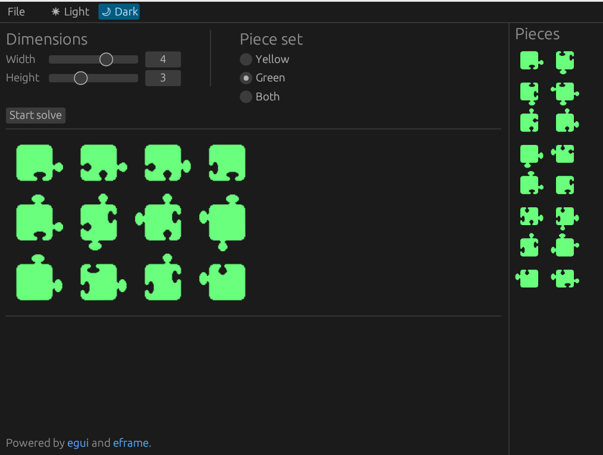

# Puzzhagoras Solver

A brute force backtracking solver for all variations of the *Puzzhagoras*
jigsaw puzzle by Vesa Timonen.

## The puzzle

A jigsaw puzzle which only has pieces in two colors. Pieces don't form a
picture. The goal is to make solid rectangles of different sizes.
Also matching two flat sides with each other is allowed.

The same pieces can be used to make these solid rectangles sizes:

 - yellow 3x3
 - green 2x2, 2x3, 2x4, 2x5, 2x6
 - green 3x3, 3x4, 3x5
 - green 4x4
 - combined 5x5

The main puzzle here is of course to make the 3x3 with all the yellow pieces,
the 4x4 with all the green pieces and then the combined 5x5 with all the
pieces together. $`3^2 + 4^2 = 5^2`$.

## The Software

The code is 100% Rust.
User interface is done using *eframe/egui* crates.
The graphics have been done with [PiskelApp](https://www.piskelapp.com).

With a release build, on an average laptop, the any of the configurations can
be solved in an instant. With a debug build, with lots of debug prints
enabled, 5x5 solve can take even 15 minutes.
